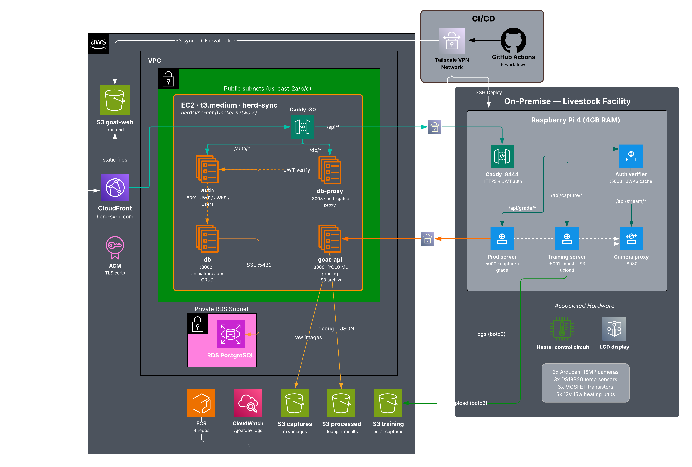

# HerdSync

AI-powered livestock grading and management platform. Camera-based body measurement using computer vision for goats and lambs - three angles, automated YOLO segmentation, calibrated pixel-to-centimeter conversion, and a grade with documented reasoning. Built for [Clean Chicken and Co.](https://www.cleanchickens.com), a livestock facility in Elk River, Minnesota.

UNT Computer Science Capstone · Spring 2026

## The Problem

Goat and lamb grading at small facilities is done by eye. Different people evaluate animals differently, producing inconsistent grades that determine what providers get paid. There's no measurement-based standard - USDA yield grading exists for cattle (ribeye area, fat thickness, carcass weight), but nothing equivalent for goats and lambs. Providers have no way to verify or dispute a grade.

## What We Built

A hybrid cloud + edge system that replaces subjective grading with camera-based measurements:

1. Three 16MP cameras capture side, top, and front views of the animal
2. Images are sent to an EC2-hosted YOLO segmentation model
3. The model extracts body measurements (heights, widths at anatomical positions)
4. Measurements + live weight produce a consistent, reproducible grade
5. Every grade has debug overlays, measurement data, and a paper trail

The platform also manages the facility's day-to-day operations: animal records, provider tracking, and training data collection for model improvement.

## Architecture



| Component           | Technology                           | Purpose                                           |
| ------------------- | ------------------------------------ | ------------------------------------------------- |
| **Frontend**        | Vanilla JS, CloudFront, S3           | Dashboard, grading UI, animal/provider management |
| **Auth Service**    | FastAPI, RS256 JWT, PostgreSQL       | Authentication, user management, JWKS             |
| **DB Service**      | FastAPI, asyncpg, PostgreSQL         | Animal, provider, grade, and audit data           |
| **DB Proxy**        | FastAPI, httpx                       | Auth-gated reverse proxy with audit logging       |
| **Grading API**     | FastAPI, PyTorch, YOLO, OpenCV       | Image analysis, measurement extraction, grading   |
| **Camera Proxy**    | Flask, gevent, OpenCV, shared memory | USB camera ownership, MJPEG streaming, capture    |
| **Prod Server**     | Flask                                | Grading workflow: capture → EC2 → grade           |
| **Training Server** | Flask                                | Burst capture → S3 upload for model training      |
| **Heater Control**  | Flask, RPi.GPIO, DS18B20             | Camera enclosure thermostat with failsafe         |
| **Auth Verifier**   | Flask, PyJWT                         | Pi-local JWT validation for Caddy                 |
| **Status Display**  | Pillow, SPI LCD                      | Real-time system health on 2.4" ILI9341           |

**Cloud (AWS us-east-2):** EC2 t3.medium runs 4 Docker containers (auth, db, db-proxy, goat-api) behind a Caddy reverse proxy. RDS PostgreSQL 17.2 for data. S3 for frontend hosting, raw captures, debug images, and training data. CloudFront CDN serves the frontend and routes all API traffic (/auth/_, /db/_, /api/\*) to EC2.

**Edge (Raspberry Pi 4):** On-premise at the facility. Owns 3 USB cameras, 3 temperature sensors, 3 heater circuits, and an SPI display. 6 application services managed by systemd. Connected to the cloud via Tailscale VPN for both API traffic and SSH deployment.

**CI/CD (GitHub Actions):** 6 workflows deploy to EC2 (Docker via Tailscale SSH), S3 (frontend sync), and Pi (git pull via Tailscale SSH).

## Repository Structure

```
goatdev/
├── auth/                   # Auth service (JWT, user management)
├── db/                     # Database service (animal, provider, grade CRUD)
├── db-proxy/               # Auth-gated DB proxy with audit logging
├── goat-api/               # AI grading API (YOLO models, measurements)
├── model/                  # YOLO weights (.pt) and calibration files
├── frontend/               # Web application
│   ├── index.html          # Landing page
│   ├── dashboard.html      # Main application (animals, grading, providers, logs)
│   ├── signin.html         # Login page
│   ├── setup.html          # Camera focus, heater, and capture setup
│   ├── js/                 # auth.js
│   └── logos/              # Brand assets (dark/light variants)
├── pi/                     # Raspberry Pi services and system config
│   ├── servers/            # camera_proxy, prod, training, heating, auth_verifier
│   ├── display/            # SPI LCD status display
│   ├── logger/             # CloudWatch logging + heartbeat cron
│   └── system/             # systemd units, Caddyfile, udev rules, deploy script
├── ec2-container-deploy-scripts/  # Docker deploy scripts for EC2
├── readme_assets/          # Architecture diagrams, screenshots
└── .github/workflows/      # CI/CD pipelines (6 workflows)
```

Each service directory has its own README with detailed documentation:

- **[`auth/`](auth/)** - RS256 JWT authentication, user management, JWKS endpoint, rate limiting
- **[`db/`](db/)** - PostgreSQL data layer, unified serial IDs, CRUD factory, schema
- **[`db-proxy/`](db-proxy/)** - Auth enforcement proxy, token caching, mutation audit logging
- **[`goat-api/`](goat-api/)** - YOLO segmentation, measurement extraction, grade calculation, S3 archival
- **[`pi/`](pi/)** - All edge device services, hardware control, deployment, diagnostics

## Grading Pipeline

1. Operator fills in species, weight, provider on the grading page
2. Pi prod server pre-checks EC2 reachability and camera health
3. Camera proxy does in-place resolution switching (640x480 → 4656x3496) per camera
4. Three full-res JPEG images sent to EC2 as multipart form
5. EC2 runs YOLO instance segmentation on each view, extracts body mask
6. Measurements computed from mask contours using calibrated pixels-per-cm values
7. Grade calculated from measurements + live weight
8. Debug overlay images generated with measurement annotations
9. Raw images → `goat-captures` S3 bucket, debug images → `goat-processed` bucket
10. Operator reviews grade, measurements, and debug overlays in a modal
11. On accept: animal record created/updated in PostgreSQL, grade result stored

## Training Data Collection Pipeline

```
Setup Page → Pi Training Server → Camera Proxy (burst) → S3 Training Bucket
```

Separate from grading. Captures 20 frames per camera at 1.5-second intervals for pose variation. All 3 cameras capture concurrently. Images uploaded as tar.gz directly to S3. Metadata (goat data, timestamps) saved as JSON alongside the images. These photos are then used in future training to improve our grading models.

## Security

- **RS256 asymmetric JWTs** - auth service signs with private key, all other services validate with public key via JWKS. No shared secrets.
- **Token rotation** - refresh tokens are single-use; each refresh issues a new pair and revokes the old one. Stored as SHA-256 hashes.
- **Rate limiting** - login attempts tracked by IP and username independently. 5 attempts per 5-minute window, 15-minute lockout.
- **S3 private buckets** - frontend bucket uses CloudFront OAC (no public access). Capture/training buckets are private with IAM policies.
- **Pi auth gating** - every API request through Caddy goes through `forward_auth` to a local JWT verifier. The verifier caches the public key from JWKS.
- **API key for Pi→EC2** - service-to-service grading calls use a shared API key in `X-API-Key` header over Tailscale. Simpler than JWT for machine-to-machine.

## Tech Stack

| Layer          | Technologies                                                |
| -------------- | ----------------------------------------------------------- |
| Frontend       | Vanilla JS, HTML/CSS, DM Sans + JetBrains Mono              |
| Auth           | FastAPI, SQLAlchemy, PyJWT (RS256), bcrypt, passlib         |
| Database       | PostgreSQL 17.2 (RDS), asyncpg, FastAPI                     |
| AI/CV          | PyTorch 2.5 (CPU), YOLO (ultralytics), OpenCV               |
| Edge           | Flask, gunicorn + gevent, OpenCV, RPi.GPIO, Pillow          |
| Infrastructure | EC2, RDS, S3, CloudFront, ECR, CloudWatch, Route53          |
| Networking     | Tailscale VPN, Caddy v2                                     |
| CI/CD          | GitHub Actions (6 workflows), Docker, Tailscale SSH         |
| Hardware       | Raspberry Pi 4 (4GB), 3x Arducam 16MP, DS18B20, ILI9341 LCD |

##

This project is intended for UNT Capstone 4901.002.

Developed and maintained by

- Ethan TenClay
- Cooper Wiethoff
- Quinn Branum
- Brandon Rubio
- Enzo Mello ESilva
