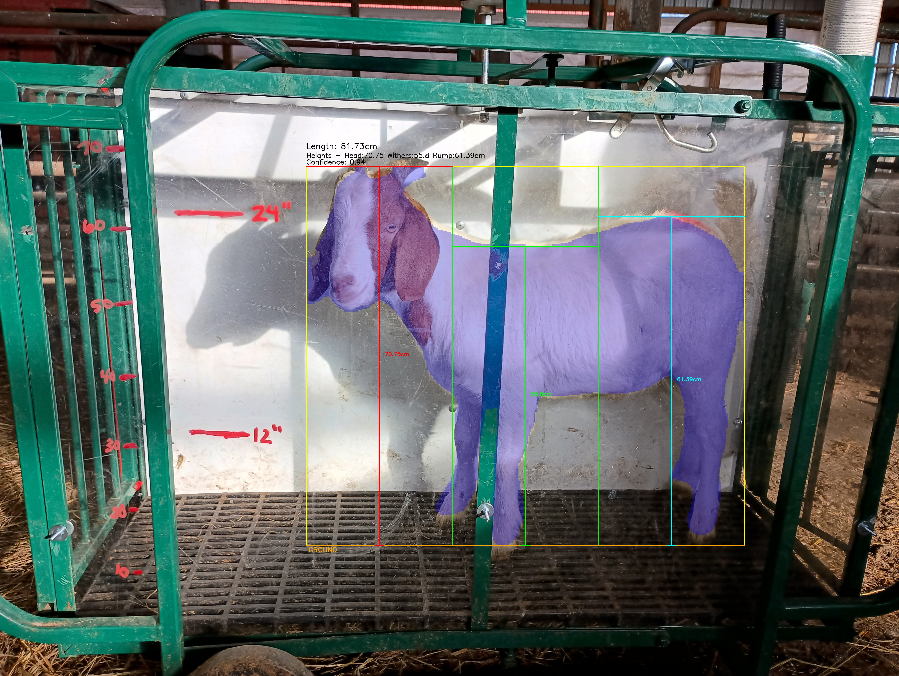

# Model Portion of Goat Grading System

AI-powered body measurement system for automatic goat grading at Becky's slaughter facility. Captures measurements from three camera angles (side, top, front).

## What Each Model Measures

| View      | Measurements                             | Model Type               |
| --------- | ---------------------------------------- | ------------------------ |
| **Side**  | Head height, Withers height, Rump height | Single-class (goat body) |
| **Top**   | Body width (torso, excludes head)        | Two-class (body + head)  |
| **Front** | Chest/shoulder width                     | Two-class (body + head)  |

## Project Structure

```
goatdev/
└── model/                              # All ML/measurement code
    ├── front/                          # Front view (chest width)
    │   ├── YOLO_MODEL_STUFF/           # Training dataset
    │   │   ├── train/
    │   │   │   ├── images/             # Training images
    │   │   │   └── labels/             # YOLO segmentation masks
    │   │   ├── valid/                  # Validation split
    │   │   │   ├── images/
    │   │   │   └── labels/
    │   │   ├── test/                   # Test split
    │   │   │   ├── images/
    │   │   │   └── labels/
    │   │   └── data.yaml               # Dataset configuration
    │   ├── best.pt                     # Trained model weights
    │   ├── front_calibration_tool.py   # Manual calibration tool
    │   ├── front_calibration.json      # Calibration results
    │   └── front_yolo_measurements.py  # Measurement script
    │
    ├── side/                           # Side view (3 heights)
    │   ├── YOLO_MODEL_STUFF/           # Training dataset
    │   │   ├── train/
    │   │   │   ├── images/
    │   │   │   └── labels/
    │   │   ├── valid/
    │   │   │   ├── images/
    │   │   │   └── labels/
    │   │   ├── test/
    │   │   │   ├── images/
    │   │   │   └── labels/
    │   │   └── data.yaml
    │   ├── best.pt                     # Trained model weights
    │   ├── side_calibration_tool.py
    │   ├── side_calibration.json
    │   └── side_yolo_measurements.py
    │
    ├── top/                            # Top view (body width)
    │   ├── YOLO_MODEL_STUFF/           # Training dataset
    │   │   ├── train/
    │   │   │   ├── images/
    │   │   │   └── labels/
    │   │   ├── valid/
    │   │   │   ├── images/
    │   │   │   └── labels/
    │   │   ├── test/
    │   │   │   ├── images/
    │   │   │   └── labels/
    │   │   └── data.yaml
    │   ├── best.pt                     # Trained model weights
    │   ├── top_calibration_tool.py
    │   ├── top_calibration.json
    │   └── top_yolo_measurements.py
    │
    ├── images/                       # Raw images from Becky
    │   ├── front/
    │   ├── side/
    │   ├── top/
    │   └── readme_example_pics/        # Example debug outputs for readme
    │
    ├── augment.py                      # Script for train/ data augmentation
    ├── venv/                           # Python env, set this up to run
    ├── requirements.txt                # Python dependencies
    ├── .gitignore
    └── MODEL-README.md                 # This file
```

## How to Run

Front, top, and side models are separated for now. They are tested individually. See notes at top of \*yolo_measurements.py files for individual details.

**SIDE VIEW:**

```bash
cd model/side

python side_yolo_measurements.py \
  --model best.pt \
  --calibration side_calibration.json \
  --batch ../images/side/ \
  --debug
```

**TOP VIEW:**

```bash
cd model/top

python top_yolo_measurements.py \
  --model best.pt \
  --calibration top_calibration.json \
  --batch ../images/top/ \
  --debug
```

**FRONT VIEW:**

```bash
cd model/front

python front_yolo_measurements.py \
  --model best.pt \
  --calibration front_calibration.json \
  --batch ../images/front/ \
  --debug
```

## Model Output Examples

### Side View



**Masks:** Single-class segmentation (goat body only)

**Measurements:**

- **Head height** (red line at top)
- **Withers height** (green line at mid-back)
- **Rump height** (blue line at rear)

### Top View


A great example of why seperate head masking is needed:\


**Masks:** Two-class segmentation (body + head separately)

- **Purple overlay:** Body mask
- **Green overlay:** Head mask

**Measurements:**

- **Body width** (red horizontal line with caps)

The magenta vertical lines show the detected torso region where measurements are taken. By separating head and body masks, the system avoids measuring head width when goats turn their heads sideways. Only the widest part of the torso is measured.

### Front View


**Masks:** Two-class segmentation (body + head separately)

- **Purple overlay:** Body mask
- **Green overlay:** Head mask

**Measurements:**

- **Chest/shoulder width** (red vertical line with caps)

The magenta horizontal lines mark the torso scan region. Like top view, separating body and head masks ensures accurate chest measurements regardless of head position.

## How It Was Built

### Data Labeling

For each angle, I took the full image set to Roboflow, a great platform for image segmentation masking and manually masked each image. I then exported each data set (angle) in about a 80/10/10 train/valid/test split.

### Data Augmentation

Since there's so little data, I then used my augment.py script to only augment the train split for each angle. This multiplied the training data by about 20 and VASTLY improved model confidence.

**Augmentation techniques:**

- Horizontal flip
- Scale
- Shift
- Noise
- Rotation (±3°)
- Brightness adjustment (±20%)

### Training

I then exported each of these full data sets to their own Google Colab notebook. I signed up for pro to use their big papa A100 GPU runtime and trained each model for about 200 epochs. Took about 30mins each go. Almost blew up my mac before figuring out Colab is a great resource for this. Each of these notebooks then gave me a best.pt that I could then bring back to my IDE to run locally.

### Measurement Calibration

Uses manual calibrations from (top/side/front)\_calibration_tool.py in each respective folder, which measures various points of the images that the user is prompted to click on, and averages the distances. This is a temporary solution until we have permanent camera fixtures.

**Known dimension:** Chute internal width: 40.64 cm (16 inches)

## Output Format

### Side View JSON

```json
{
  "filename": "IMG_20251113_094952971_jpg.rf.be22cb8faa8402cc1e11e26f74a4c5fa.jpg",
  "success": true,
  "image_width": 4080,
  "image_height": 3072,
  "calibration_method": "manual",
  "pixels_per_cm": 24.34,
  "yolo_confidence": 0.951,
  "body_length_cm": 97.42,
  "length_to_height_ratio": 1.453,
  "head_height_cm": 67.06,
  "withers_height_cm": 52.31,
  "rump_height_cm": 56.95,
  "body_area_square_cm": 2674.53,
  "debug_image": "debug/debug_IMG_20251113_094952971_jpg.rf.be22cb8faa8402cc1e11e26f74a4c5fa.jpg"
}
```

### Top View JSON

```json
{
  "filename": "IMG_xxx.jpg",
  "success": true,
  "image_width": 4080,
  "image_height": 3072,
  "calibration_method": "manual",
  "pixels_per_cm": 25.4,
  "yolo_confidence": 0.45,
  "body_width_cm": 32.1,
  "body_length_cm": 95.3,
  "body_area_square_cm": 2850.2,
  "length_to_width_ratio": 2.97,
  "debug_image": "debug/debug_IMG_xxx.jpg"
}
```

### Front View JSON

```json
{
  "filename": "IMG_20251113_094244496_HDR_jpg.rf.ad847b41e49ef6ebba4664c6c8a690e0.jpg",
  "success": true,
  "image_width": 4080,
  "image_height": 3072,
  "calibration_method": "manual",
  "pixels_per_cm": 22.07,
  "yolo_confidence": 0.916,
  "max_width_pixels": 815,
  "max_width_row": 1152,
  "body_width_cm": 36.94,
  "body_area_square_cm": 1608.07,
  "debug_image": "debug/debug_IMG_20251113_094244496_HDR_jpg.rf.ad847b41e49ef6ebba4664c6c8a690e0.jpg"
}
```

Also outputs a debug folder with images showing the segmentation mask and measurement lines drawn on the image for visual verification.
