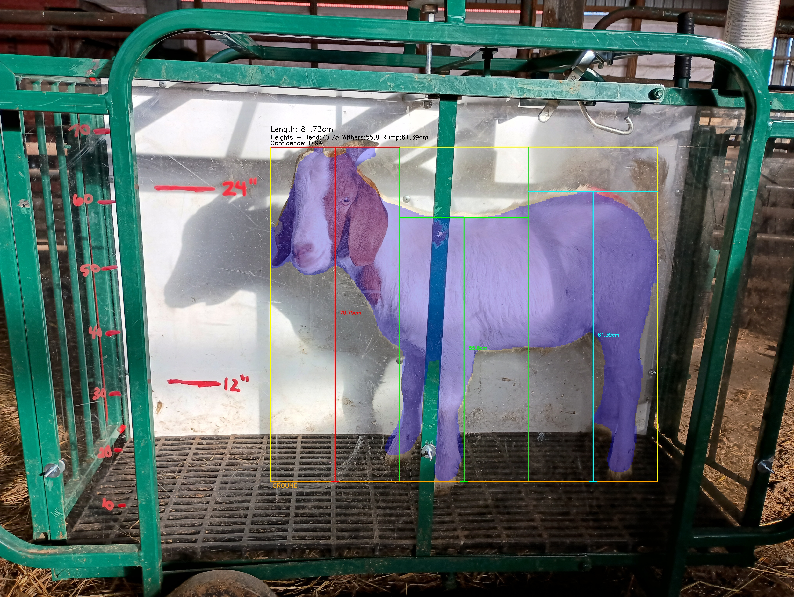

# HerdSync Model System

This is the computer-vision measurement subsystem for HerdSync, built for goat grading at Becky's facility. It uses three camera views, YOLO segmentation, and per-view calibration to turn raw animal photos into repeatable body measurements that feed the grading workflow.

The goal of this part of the project is not just to detect a goat in an image. It is to produce measurements that a person can inspect, question, and trust. That is why each view has its own measurement logic, and why the system saves debug overlays showing exactly what the model measured.

## What Each View Measures

| View | Measurements | Why this angle matters |
| --- | --- | --- |
| **Side** | Head height, withers height, rump height | Side view is the only angle that reliably shows vertical body landmarks from top of body to ground. |
| **Top** | Shoulder width, waist width, rump width | Top view is best for comparing body widths along the animal's length without leg occlusion. |
| **Front** | Chest/shoulder width | Front view captures chest spread and shoulder width that the top view cannot represent on its own. |

## How Measurement Works

Each image goes through the same high-level pipeline:

1. A YOLO segmentation model isolates the goat from the background.
2. Calibration converts pixel distances into centimeters for that camera view.
3. View-specific geometry extracts measurements from the mask.
4. The batch processor merges all three views into one goat record with measurements, confidence scores, and any per-view failures.

The three views are intentionally different. The side model looks for vertical distances at anatomical regions along the body. The production top-view pipeline extracts width measurements at anatomical positions such as shoulder, waist, and rump. The front model measures chest width from the front-facing silhouette.

For the top and front models, separating body and head masks matters a lot. If the head gets included in the torso silhouette, width measurements can become misleading, especially when a goat turns its head sideways. Treating the head as a separate class reduces that problem and makes the measurement more anatomically meaningful.

## Why The Model Is Interpretable

The system saves debug images because confidence alone is not enough. A high-confidence prediction is only useful if the measured line is actually drawn across the right part of the goat.

### Side View



The side overlay shows three vertical measurements taken from different horizontal sections of the body. This makes it easy to verify whether the model is actually measuring head height, withers height, and rump height rather than just drawing lines on a broad bounding box.

### Top View


The top overlay is useful because it shows how the model reasons about width along the body rather than treating the animal as a single undifferentiated shape. The separate body and head masks are important here because a turned head can easily distort a width measurement if the whole animal is treated as one blob.

### Front View


The front overlay focuses on chest and shoulder width within the torso region. As with the top view, splitting head and body masks helps avoid measuring the head instead of the chest when the animal is not perfectly aligned.

## Example Combined Output

The combined output below reflects the live API response shape defined in [`goat-api/api/models.py`](/Users/ethantenclay/Desktop/goatdev/goat-api/api/models.py) and assembled in [`goat-api/api/main.py`](/Users/ethantenclay/Desktop/goatdev/goat-api/api/main.py). Individual per-view scripts still emit their own JSON, but the production system consumes and returns a combined analysis object.

```json
{
  "serial_id": "4",
  "timestamp": "2025-12-03T23:13:48.926722",
  "live_weight_lbs": 55,
  "measurements": {
    "head_height_cm": 72.73,
    "withers_height_cm": 53.09,
    "rump_height_cm": 55.47,
    "shoulder_width_cm": 34.51,
    "waist_width_cm": 31.84,
    "rump_width_cm": 35.02,
    "top_body_width_cm": null,
    "front_body_width_cm": 32.31,
    "avg_body_width_cm": 33.41
  },
  "confidence_scores": {
    "side": 0.949,
    "top": 0.969,
    "front": 0.959
  },
  "grade": "Choice",
  "grade_details": {
    "category": "goat_meat"
  },
  "view_errors": null,
  "warnings": null,
  "all_views_successful": true,
  "success": true
}
```

This output is designed to be useful both to the grading pipeline and to a human reviewer. It keeps the raw measurements, per-view confidence scores, grading result, and enough status information to show whether one camera angle failed or a fallback path was used.

## How I Built It

I built this from a relatively small real-world image set captured at the facility. For each angle, I uploaded the images to Roboflow and manually masked the animals for segmentation. After labeling, I exported each angle as its own dataset with roughly an 80/10/10 train, validation, and test split.

Because the dataset was small, augmentation ended up being a major part of the process. I used [`augment.py`](/Users/ethantenclay/Desktop/goatdev/model/augment.py) to augment only the training split for each angle. That expanded the usable training set by roughly 20x and made a noticeable difference in model confidence and consistency.

Training locally stopped making sense pretty quickly, so I moved the actual model training to Google Colab. I used the paid A100 runtime, trained each view-specific model for roughly 200 epochs, and then brought the resulting `best.pt` weights back into this repo for local measurement and testing.

Calibration is still handled manually for each view. The calibration tools ask the user to click known reference distances in the images, average those samples, and store a pixels-per-centimeter value in a JSON file. That is a practical workaround for the current deployment environment, where camera placement is not yet fixed enough to hardcode calibration once and forget it.

## What I Learned

- Small datasets can still work well for this kind of task, but only if augmentation is taken seriously.
- Top and front width measurements needed explicit head-vs-body separation to stay believable.
- Debug overlays became one of the most important validation tools because they show whether the model measured the right anatomy, not just whether it detected a goat.
- Calibration is not just a software concern here. It reflects a real physical constraint in how the cameras are mounted and how consistent the chute setup is day to day.
- The most useful output is not just a prediction. It is a measurement with enough visual evidence that someone at the facility could inspect it and understand why the system reached that number.

## Current Limitations

- Calibration is still manual and temporary.
- Measurement quality depends on camera consistency and chute setup.
- The training dataset is still relatively small.
- Unusual pose or head position can still create width edge cases, especially when one view is noisier than the others.

## Important Files

- [`augment.py`](/Users/ethantenclay/Desktop/goatdev/model/augment.py): data augmentation script used to expand the training split.
- [`side/side_yolo_measurements.py`](/Users/ethantenclay/Desktop/goatdev/model/side/side_yolo_measurements.py), [`top/top_yolo_measurements.py`](/Users/ethantenclay/Desktop/goatdev/model/top/top_yolo_measurements.py), [`front/front_yolo_measurements.py`](/Users/ethantenclay/Desktop/goatdev/model/front/front_yolo_measurements.py): view-specific measurement logic.
- [`side/side_calibration_tool.py`](/Users/ethantenclay/Desktop/goatdev/model/side/side_calibration_tool.py), [`top/top_calibration_tool.py`](/Users/ethantenclay/Desktop/goatdev/model/top/top_calibration_tool.py), [`front/front_calibration_tool.py`](/Users/ethantenclay/Desktop/goatdev/model/front/front_calibration_tool.py): manual calibration utilities for each camera angle.
- [`goat-api/api/grader.py`](/Users/ethantenclay/Desktop/goatdev/goat-api/api/grader.py) and [`goat-api/api/models.py`](/Users/ethantenclay/Desktop/goatdev/goat-api/api/models.py): production measurement extraction and response contract used by the live grading API.
- `images/all_goats_grouped/` and `weights.json`: grouped image sets and associated weights used for combined evaluation.
