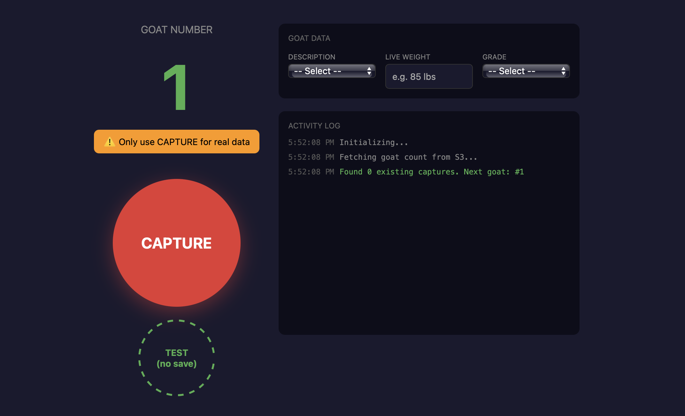

# Raspberry Pi Capture System

## Architecture Overview


The Pi runs two Flask services for goat image capture, both accessible remotely via Tailscale VPN.

```
┌─────────────────────────────────────────────────────────────┐
│                      Raspberry Pi 5 (4GB)                   │
│                                                             │
│  ┌─────────────────────┐    ┌──────────────────────┐        │
│  │   goat-prod.service │    │ goat-training.service│        │
│  │       Port 5000     │    │       Port 5001      │        │
│  │                     │    │                      │        │
│  │  Single-shot capture│    │  20-image capture    │        │
│  │  + EC2 grading      │    │  + S3 upload         │        │
│  └──────────┬──────────┘    └──────────┬───────────┘        │
│             │                          │                    │
│             ▼                          ▼                    │
│  ┌──────────────────────────────────────────────────────┐   │
│  │              3x USB Cameras (udev symlinks)          │   │
│  │ /dev/camera_side  /dev/camera_top  /dev/camera_front |   │
│  └──────────────────────────────────────────────────────┘   │
│                                                             │
│  ┌─────────────────────┐    ┌─────────────────────┐         │
│  │  CloudWatch Logger  │    │  Heartbeat Cron     │         │
│  │  (all services)     │    │  (every 2 min)      │         │
│  └─────────────────────┘    └─────────────────────┘         │
└─────────────────────────────────────────────────────────────┘
                              │
                              │ Tailscale VPN
                              ▼
┌─────────────────────────────────────────────────────────────────┐
│                         Remote Access                           │
│                                                                 │
│   Developer Machine ──────► ssh pi@100.xxx.xxx.xxx              │
│                      ──────► curl http://100.xxx.xxx.xxx:5000   │
│                                                                 │
│   EC2 API Server ◄────────── Pi sends images for grading        │
│   S3 Buckets     ◄────────── Pi uploads training data           │
└─────────────────────────────────────────────────────────────────┘
```

## Services

### Production Service (`goat-prod.service`) - Port 5000

Single-shot capture for live grading. Captures one image per camera, sends all three to EC2 API, returns grade.

**Workflow:**

1. Receive POST with `serial_id` and `live_weight`
2. Capture 1 image from each camera (batched 2+1 to avoid OOM)
3. POST images to EC2 `/analyze` endpoint
4. Return grade result

**Key Endpoints:**

| Endpoint       | Method | Description                               |
| -------------- | ------ | ----------------------------------------- |
| `/health`      | GET    | Quick status check                        |
| `/diagnostics` | GET    | Detailed system info                      |
| `/grade`       | POST   | Capture + grade workflow                  |
| `/grade/test`  | POST   | Grade with uploaded images (skip capture) |
| `/test`        | GET    | Full connectivity test                    |
| `/status`      | GET    | Current capture state                     |
| `/cancel`      | POST   | Emergency stop                            |

### Training Service (`goat-training.service`) - Port 5001

Multi-image capture for model training. Captures 20 images per camera at 1fps, uploads to S3 as tarballs.

**Workflow:**

1. Receive POST with `goat_id` and optional metadata
2. Capture 20 images per camera (1 second apart)
3. Tar images per camera, upload to S3
4. Upload metadata JSON

**Key Endpoints:**

| Endpoint       | Method | Description           |
| -------------- | ------ | --------------------- |
| `/health`      | GET    | Quick status check    |
| `/diagnostics` | GET    | Detailed system info  |
| `/record`      | POST   | Start capture session |
| `/status`      | GET    | Current capture state |
| `/cancel`      | POST   | Emergency stop        |

## Tailscale Setup

Tailscale provides secure remote access to the Pi without port forwarding or exposing it to the public internet.

### Network Topology

```
┌──────────────────┐     ┌──────────────────┐     ┌──────────────────┐
│  Developer Mac   │     │   Raspberry Pi   │     │   EC2 Instance   │
│  100.xxx.xxx.1   │◄───►│  100.xxx.xxx.126 │◄───►│  (public IP)     │
└──────────────────┘     └──────────────────┘     └──────────────────┘
         │                        │                        │
         └────────────────────────┴────────────────────────┘
                         Tailscale Mesh VPN
```

### Access Methods

**SSH to Pi:**

```bash
ssh pi@100.xxx.xxx.xxx
```

**Test services:**

```bash
# Production health
curl http://100.xxx.xxx.xxx:5000/health

# Training health
curl http://100.xxx.xxx.xxx:5001/health

# Full diagnostics
curl http://100.xxx.xxx.xxx:5000/diagnostics | jq
```

### Tailscale Admin

- Dashboard: https://login.tailscale.com/admin/machines
- Pi appears as `goat-pi` in the machine list
- Can enable/disable access, view connection status, manage ACLs

## Camera Configuration

Cameras are mapped to stable device paths via udev rules:

| View  | Symlink             | USB Port |
| ----- | ------------------- | -------- |
| Side  | `/dev/camera_side`  | 1.2      |
| Top   | `/dev/camera_top`   | 1.3      |
| Front | `/dev/camera_front` | 1.4      |

**Capture Settings:**

- Resolution: 4656 × 3496 (16MP)
- Format: MJPEG
- Native FPS: 10
- Warmup: 10 frames skipped for autofocus and white balance

## Logging

All services log to AWS CloudWatch under the `/goatdev` log group:

| Stream         | Source             |
| -------------- | ------------------ |
| `pi/prod`      | Production service |
| `pi/training`  | Training service   |
| `pi/heartbeat` | Health monitoring  |

## Heartbeat Monitoring

A cron job runs every 2 minutes checking service health:

- Verifies `goat-prod` service is active
- Verifies port 5000 is listening
- Logs errors to CloudWatch only when unhealthy
- Logs single "recovered" message when health restored

## System Configuration

All Pi system config lives in `pi/system/` and is deployed via the CI pipeline. This means systemd services, udev rules, and cron jobs can be updated with a git push, no SSH needed.

### Repo Structure

```
pi/
├── prod_server.py           # Production service
├── training_server.py       # Training service
├── focus_tool.py            # Camera focus adjustment
├── requirements.txt         # Python dependencies
├── logger/
│   ├── pi_cloudwatch.py     # Shared CloudWatch logging module
│   └── pi_heartbeat_cron.py # Heartbeat cron script
└── system/
    ├── goat-prod.service    # Systemd unit for production
    ├── goat-training.service# Systemd unit for training
    ├── 99-cameras.rules     # Udev rules for camera symlinks
    └── goat-heartbeat.cron  # Cron job for health monitoring
```

## Quick Reference

| Task               | Command                                |
| ------------------ | -------------------------------------- |
| SSH to Pi          | `ssh pi@100.xxx.xxx.xxx`               |
| Restart production | `sudo systemctl restart goat-prod`     |
| Restart training   | `sudo systemctl restart goat-training` |
| View prod logs     | `journalctl -u goat-prod -f`           |
| View training logs | `journalctl -u goat-training -f`       |
| Check cameras      | `ls -la /dev/camera_*`                 |
| Kill stuck ffmpeg  | `sudo pkill -9 ffmpeg`                 |
| Check memory       | `free -h`                              |
| Check disk         | `df -h /tmp`                           |
| Tailscale status   | `tailscale status`                     |

---

## Training Capture System

Captures training images from 3 USB cameras and uploads them to S3 for YOLO model training.

### Overview

The training service (`training_server.py`) exposes a REST API on port 5001. A web UI at `herd-sync.com/training` connects to the API to trigger captures. Each capture session photographs a single goat from three angles (side, top, front), producing 20 images per camera, 60 total, with exactly 1-second spacing between frames.

Images are tarred per camera and uploaded to S3. An optional metadata JSON file records goat data (description, weight, grade) alongside the images.

### How Capture Works

1. Client POSTs to `/record` with goat_id, goat_data, and capture mode
2. Server pre-checks: disk space, camera availability, stale processes
3. Cameras capture in **batches of 2** to stay within RAM limits:
   - Batch 1: side + top in parallel (~21s)
   - Batch 2: front alone (~21s)
   - Total: ~42s per goat
4. Each camera runs a single ffmpeg process that:
   - Opens the V4L2 device at native 10fps MJPEG
   - Skips the first 1 second (10 frames) for autofocus/white balance warmup
   - Selects every 10th frame thereafter → 1 frame per second
   - Decodes and re-encodes with `-threads 1` to limit memory (~500MB per process)
   - Writes 20 individual JPEG files to `/tmp`
5. Images are validated (minimum size check)
6. Per-camera images are tarred (`images.tar.gz`) and uploaded to S3
7. Metadata JSON uploaded alongside if goat_data was provided
8. Temp files cleaned up

#### Why Not All 3 Cameras in Parallel?

Each ffmpeg process decoding 4656×3496 frames uses ~500MB RAM. Three simultaneous processes exceed 4GB and trigger the OOM killer. The 2+1 batching keeps peak memory at ~1GB for ffmpeg.

#### Why Not `-codec:v copy`?

Raw MJPEG passthrough (`-codec:v copy`) uses almost no RAM, but ffmpeg can't apply the `select` filter without decoding. The select filter is required to get correct 1-second frame spacing since the cameras only support 10fps minimum at this resolution.

### S3 Structure

```
s3://training-********/
├── 1/
│   ├── side/images.tar.gz      # 20 JPEGs
│   ├── top/images.tar.gz       # 20 JPEGs
│   ├── front/images.tar.gz     # 20 JPEGs
│   └── goat_data.json          # metadata
├── 2/
│   ├── side/images.tar.gz
│   ├── top/images.tar.gz
│   ├── front/images.tar.gz
│   └── goat_data.json
└── ...
```

Each tar contains files named `{goat_id}_{camera}_{01-20}.jpg`.

#### goat_data.json

```json
{
  "goat_id": "17",
  "timestamp": "2026-02-10T18:30:00.000000",
  "cameras": ["side", "top", "front"],
  "images_per_camera": 20,
  "resolution": "4656x3496",
  "capture_fps": 1,
  "description": "meat",
  "live_weight": "85 lbs",
  "grade": "choice"
}
```

### Training API Endpoints

#### `GET /health`

Quick health check. Returns camera availability, disk space, and capture state.

```json
{
  "status": "ok",
  "cameras": { "side": true, "top": true, "front": true },
  "disk_free_mb": 2500,
  "recording_active": false
}
```

#### `GET /diagnostics`

Detailed diagnostics including per-camera device checks, S3 connectivity, and current capture config.

#### `POST /record`

Start a capture session.

**Request body:**

```json
{
  "goat_id": "17",
  "goat_data": {
    "description": "meat",
    "live_weight": "85 lbs",
    "grade": "choice"
  },
  "is_test": false,
  "require_all_cameras": true
}
```

**Modes:**

- **Real** (`is_test: false`): All 3 cameras must succeed. Images uploaded to S3. Any camera failure aborts the entire batch.
- **Test** (`is_test: true`): Captures with whatever cameras are available. Checks S3 access but does not upload. Files are cleaned up immediately.

**Error codes:** `CAPTURE_IN_PROGRESS`, `INVALID_GOAT_ID`, `LOW_DISK_SPACE`, `MISSING_CAMERAS`, `NO_CAMERAS`

#### `GET /status`

Poll capture progress. Used by the web UI during capture.

```json
{
  "active": true,
  "goat_id": "17",
  "started_at": "2026-02-10T18:30:00.000000",
  "progress": "capturing",
  "last_error": null,
  "last_result": null
}
```

Progress stages: `starting` → `capturing` → `uploading` → (done)

For test mode: `starting` → `capturing` → `checking_s3` → (done)

#### `POST /cancel`

Emergency stop. Kills all ffmpeg processes, cleans up temp files, resets state.

### Training Web UI



Hosted at `herd-sync.com/training` — a single-page app that connects to the Pi server over Tailscale.

Features:

- Password-protected login
- Auto-incrementing goat counter (synced from S3 bucket listing)
- Goat data form (description, weight, grade)
- Big red CAPTURE button (real mode) and smaller TEST button
- Activity log showing capture progress in real-time
- Polls `/status` every 500ms, deduplicates status messages

### Training Configuration

All config is at the top of `training_server.py`:

| Setting                     | Default             | Description                                       |
| --------------------------- | ------------------- | ------------------------------------------------- |
| `NUM_IMAGES`                | 20                  | Images per camera per capture                     |
| `CAPTURE_FPS`               | 1                   | Target frames per second (spacing between images) |
| `CAMERA_NATIVE_FPS`         | 10                  | Camera's actual FPS at capture resolution         |
| `IMAGE_WIDTH`               | 4656                | Capture width in pixels                           |
| `IMAGE_HEIGHT`              | 3496                | Capture height in pixels                          |
| `MIN_DISK_MB`               | 1000                | Minimum free disk space to start capture          |
| `MIN_IMAGE_BYTES`           | 50000               | Minimum valid image size (50KB)                   |
| `FFMPEG_TIMEOUT_SEC`        | 30                  | Per-ffmpeg process timeout                        |
| `CAPTURE_TOTAL_TIMEOUT_SEC` | 60                  | Total timeout for one camera's full capture       |
| `S3_TRAINING_BUCKET`        | `training-********` | S3 bucket (overridable via env var)               |

### Training Troubleshooting

**OOM / ffmpeg killed (code -9):** The `MAX_PARALLEL = 2` batching should prevent this. If it still happens, reduce to `MAX_PARALLEL = 1` (sequential capture, ~63s per goat).

**Blurry/pink first images:** The 1-second warmup skip should handle this. If images are still blurry, increase `warmup_frames` in `capture_single_camera`.

**"Camera does not support resolution":** Check supported formats with `v4l2-ctl -d /dev/camera_side --list-formats-ext`. The camera may not support 4656×3496 MJPEG.

**S3 403 / InvalidSignature:** Check that the Pi's clock is synced (`timedatectl status`) and AWS credentials are valid (`aws sts get-caller-identity`).

**Capture timeout on client:** The web UI polls for 2 minutes (240 × 500ms). If captures + upload consistently exceed this, increase `maxAttempts` in the training `index.html`.

**Camera "Device or resource busy":** A previous ffmpeg process didn't exit cleanly. Run `sudo pkill -9 ffmpeg` or hit the `/cancel` endpoint.

**Stale ffmpeg processes:** The server kills orphaned ffmpeg processes on startup and before each capture. If cameras seem stuck, restart the service: `sudo systemctl restart goat-training`.
